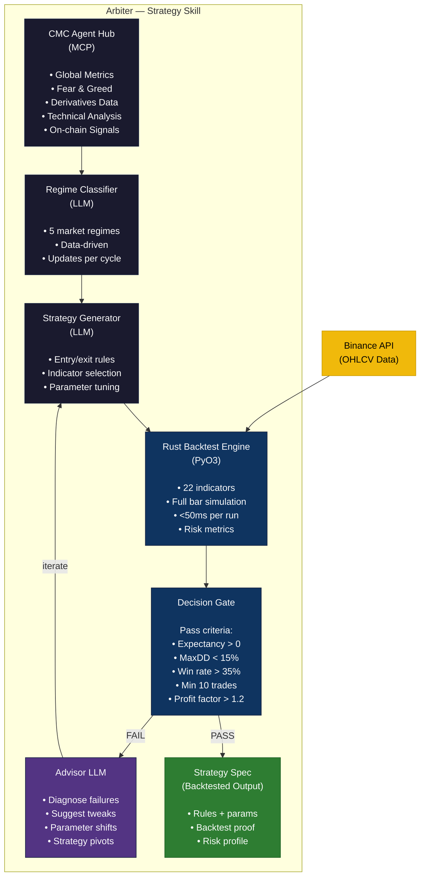
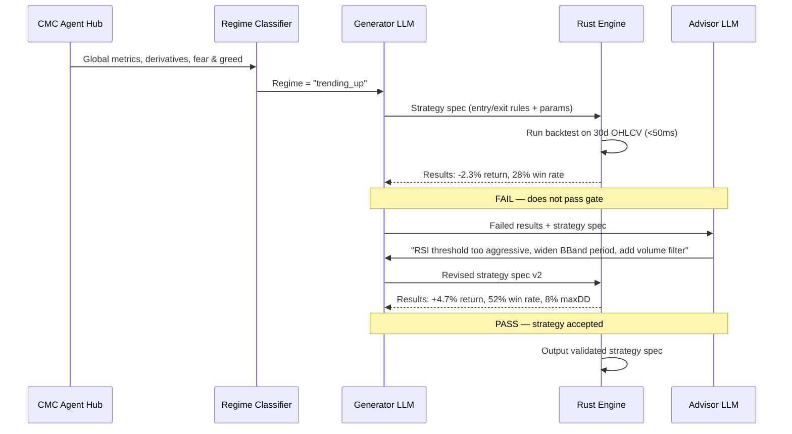

# Arbiter — CMC Strategy Skill with Closed-Loop Rust Validation

## BNB Hack: AI Trading Agent Edition | Track 2: Strategy Skills ($6,000)

---

## One-Liner

A CMC Strategy Skill that uses multi-agent LLM optimization with Rust backtest validation to produce regime-aware trading strategies with proven edge — not guesses.

---

## The Problem

LLM-generated trading strategies are **unvalidated opinions**.

Every "AI strategy generator" today does this:

```
Prompt LLM → Get rules → Hope it works
```

There's no feedback loop. No quantitative validation. No iteration based on real market data. The LLM has no idea if its output has positive expectancy or is pure noise.

This is like writing code without ever running it.

---

## The Solution: Arbiter

A **closed-loop strategy optimization system** where:

1. **CMC Agent Hub** provides regime classification data (global metrics, derivatives, technical analysis)
2. **Generator LLM** proposes strategy rules tuned to the detected regime
3. **Rust Backtest Engine** validates every strategy against 30 days of real OHLCV data in <50ms
4. **Advisor LLM** reviews results, identifies weaknesses, suggests improvements
5. **Loop repeats** until the strategy passes quantitative thresholds or exhausts iterations

The key insight: **the LLM doesn't guess — it iterates with evidence.**

---

## Architecture



---

## The Optimization Loop (NVIDIA Signal Discovery Inspired)

Inspired by NVIDIA's approach to automated signal discovery in quantitative finance, Arbiter treats strategy generation as an **optimization problem with a measurable objective function**.



### Why this works:

- **Fast iteration**: Rust engine validates in <50ms, so 20 iterations take ~1 second
- **Measurable feedback**: Not "does this look good?" but "does this make money on real data?"
- **LLM as optimizer**: The Advisor sees what failed and why, making each iteration targeted
- **No overfitting guard**: Minimum trade count requirement prevents curve-fitting

---

## CMC Agent Hub Usage (MCP Tools)

Arbiter uses CMC Agent Hub via MCP for regime classification signals:

| MCP Tool                    | Purpose in Arbiter                                  |
| --------------------------- | --------------------------------------------------- |
| `get_global_metrics`        | Market cap dominance, total volume — macro regime   |
| `get_fear_greed_index`      | Sentiment extreme detection                         |
| `get_derivatives_data`      | Funding rates, open interest — positioning regime   |
| `get_technical_indicators`  | RSI, MACD on major assets — technical regime        |
| `get_trending_tokens`       | Momentum candidates for strategy application        |
| `get_token_metadata`        | Token fundamentals for filtering                    |

These signals feed the LLM regime classifier which determines WHICH type of strategy to generate.

---

## Strategy Toolkit (Regime-Adaptive)

### Regime Classification (via CMC + LLM):

| Regime              | Detection Signals                                   | Strategy Type Generated                    |
| ------------------- | --------------------------------------------------- | ------------------------------------------ |
| **TRENDING_UP**     | EMA alignment, ADX > 25, positive funding, bullish  | Momentum breakouts, trailing stops         |
| **TRENDING_DOWN**   | EMA inversion, negative funding, Fear dominant      | Short momentum, defensive positioning      |
| **MEAN_REVERTING**  | Low ADX, BBand oscillation, neutral sentiment       | Fade at extremes, RSI reversals            |
| **HIGH_VOLATILITY** | ATR spike, extreme Fear & Greed, OI changes         | Wide stops, volatility capture             |
| **CHOPPY**          | Low ATR, mixed signals, no directional bias         | Conservative or skip (wait for clarity)    |

### Indicators Available (Rust Engine — 22 total):

**Moving Averages**: SMA, EMA, DEMA, HMA, WMA, VWAP, RMA
**Momentum**: RSI, MACD, Aroon, CCI, ROC, Stochastic, Swings, Pressure
**Volatility**: ATR, Bollinger Bands, Keltner Channel, Donchian Channel
**Volume**: OBV
**Efficiency**: Efficiency Ratio, Linear Regression

---

## Tech Stack

| Component         | Technology                                             |
| ----------------- | ------------------------------------------------------ |
| Orchestrator      | Python 3.11+ / asyncio                                 |
| Backtest Engine   | Rust (PyO3 + maturin) — 22 indicators, <50ms          |
| Market Data       | Binance public API (OHLCV)                             |
| Regime Signals    | CMC Agent Hub (MCP) — global metrics, derivatives, TA  |
| LLM (Generation)  | GPT-4o-mini (strategy generation + regime classify)    |
| LLM (Advisory)    | GPT-4o-mini (backtest analysis + improvement advice)   |
| Dashboard         | Vite + React + TradingView Lightweight Charts          |
| API Server        | FastAPI + WebSocket (live backtest streaming)           |

---

## What Makes Arbiter Unique

1. **Rust Validation Engine**: Not just LLM opinions — every strategy is quantitatively proven against real market data before acceptance. <50ms per backtest enables rapid iteration.

2. **Multi-Agent Feedback Loop**: Generator proposes, Engine validates, Advisor diagnoses failures and guides improvements. This is optimization, not generation.

3. **Regime-Aware Generation**: CMC Agent Hub data classifies the current market regime, so strategies are always contextually appropriate — not generic.

4. **Backtestable Output**: The deliverable isn't "a prompt that generates rules" — it's a validated strategy spec with backtest proof (Sharpe, drawdown, win rate, trade count).

5. **Speed**: Rust engine enables 20+ strategy iterations per second. The LLM can explore the strategy space efficiently with instant feedback.

---

## Special Prize Eligibility

### Best Use of Agent Hub ($2K)

- Uses CMC MCP tools for regime classification (global metrics, derivatives, technical analysis)
- Regime detection is the core differentiator that makes generated strategies contextual
- Without CMC data, the Skill would just be blind strategy generation

### Best Use of BNB AI Agent SDK ($2K)

- ERC-8004 on-chain identity registration via `integrations/bnb_sdk.py`
- Agent registered on BSC with verifiable identity
- Strategy outputs tagged with agent identity for provenance

---

## Deliverables (Track 2 Requirements)

1. **Strategy Spec**: Regime-adaptive rules with entry/exit conditions, indicator parameters
2. **Backtest Results**: Quantitative proof — Sharpe, profit factor, win rate, max drawdown
3. **Code**: Full optimization loop (Python orchestrator + Rust engine + LLM agents)
4. **Dashboard**: Visual backtest results, equity curves, trade tables
