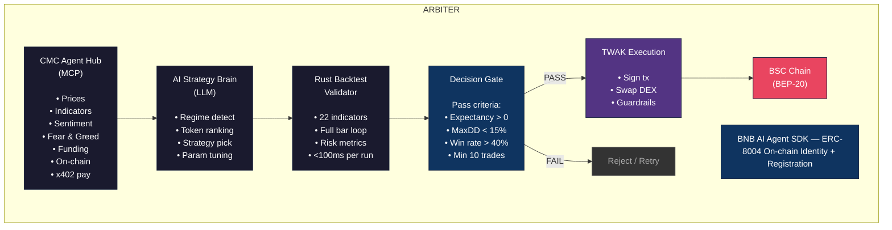
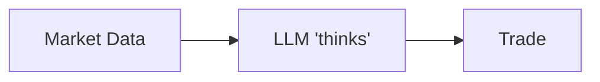
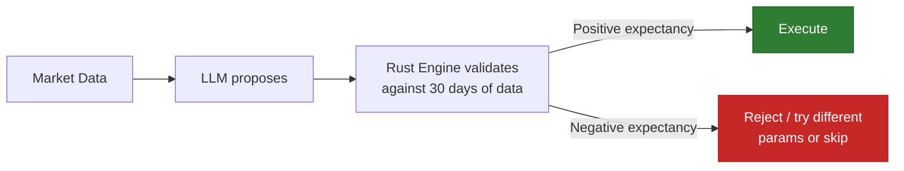

# Arbiter — Backtest-Validated Autonomous Crypto Trader

## BNB Hack: AI Trading Agent Edition | Track 1: Autonomous Trading Agents

---

## One-Liner

An AI trading agent that validates every trade decision against a Rust-powered backtest engine before execution — bringing institutional quant discipline to on-chain autonomous trading on BSC.

---

## The Problem

Every AI trading agent in crypto today works the same way:

```
LLM reads market data → forms opinion → trades on gut feeling
```

This is how retail traders lose money. Institutional quant firms do the opposite:

```
Classify regime → propose strategy → validate against historical data → only execute if positive expectancy confirmed
```

No one has brought this discipline to an AI agent on-chain. Until now.

---

## The Solution: Arbiter

An autonomous trading agent with a **real-time backtest validation loop**. The agent:

1. **Scans 149 eligible tokens** every cycle using CMC Agent Hub
2. **Classifies market regime** (trending / mean-reverting / volatile / choppy)
3. **Selects optimal strategy** for the detected regime
4. **Validates the strategy** against recent data using a Rust backtest engine (<100ms)
5. **Only executes** if the backtest shows positive expectancy + acceptable drawdown
6. **Signs and processes transactions autonomously** via Trust Wallet Agent Kit

The key insight: **the agent never trades on belief — it trades on evidence.**

---

## Architecture



---

## Core Innovation: The Validation Loop

### What Every Other Agent Does:



### What Arbiter Does:



This is the **only agent in the competition with a quantitative validation gate**.

---

## Multi-Token Rotation Edge

With 149 eligible tokens, most agents will trade 2-5 familiar assets. Arbiter systematically scans ALL 149 tokens and picks only the highest-conviction setups.

### Rotation Logic:

1. **Hourly scan**: Fetch latest OHLCV + indicators for all 149 tokens via CMC
2. **Pre-filter**: Rank by momentum score, volume, volatility regime fit
3. **Top 10 → Backtest**: Run strategy validation on top 10 candidates
4. **Top 3-5 → Execute**: Only trade tokens where backtest passes the gate
5. **Position management**: Rotate out of weakening setups, rotate into new signals

**Structural advantage**: More opportunity flow = more chances to find edge.

---

## Strategy Toolkit (Regime-Adaptive)

### Regime Classification (via CMC data):

| Regime              | Detection Signals                                            | Strategy Applied                                   |
| ------------------- | ------------------------------------------------------------ | -------------------------------------------------- |
| **TRENDING_UP**     | EMA alignment, ADX > 25, positive funding, bullish sentiment | Momentum breakouts, trailing stops                 |
| **TRENDING_DOWN**   | EMA inversion, negative funding, Fear dominant               | Short momentum, tight risk, rotate to stables      |
| **MEAN_REVERTING**  | Low ADX, price oscillating in BBands, neutral sentiment      | Fade at BBand extremes, RSI oversold/overbought    |
| **HIGH_VOLATILITY** | ATR spike, VIX-equivalent high, Fear & Greed extreme         | Wider stops, smaller positions, volatility capture |
| **CHOPPY**          | Low ATR, random walk behavior, mixed signals                 | Minimal trading, wait for regime clarity           |

### Indicators Available (from Rust engine):

**Moving Averages**: SMA, EMA, DEMA, HMA, WMA, VWAP, RMA  
**Momentum**: RSI, MACD, Aroon, CCI, ROC, Stochastic, Swings, Pressure  
**Volatility**: ATR, Bollinger Bands, Keltner Channel, Donchian Channel  
**Volume**: OBV  
**Efficiency**: Efficiency Ratio, Linear Regression

### Strategy Templates:

#### 1. Momentum Breakout (Trending Regime)

```
Entry: EMA(9) > EMA(21) AND RSI > 55 AND MACD histogram positive AND price > Keltner upper
Exit:  EMA(9) crosses below EMA(21) OR RSI < 45 OR trailing stop 2×ATR
```

#### 2. Mean Reversion (Ranging Regime)

```
Entry: Price touches lower BBand AND RSI < 30 AND Stochastic oversold
Exit:  Price reaches BBand midline OR RSI > 65 OR stop at 1.5×ATR below entry
```

#### 3. Momentum Short (Bearish Regime)

```
Entry: EMA(9) < EMA(21) AND RSI < 45 AND MACD histogram negative AND price < Keltner lower
Exit:  EMA(9) crosses above EMA(21) OR RSI > 55 OR trailing stop 2×ATR above
```

#### 4. Volatility Capture (High Vol Regime)

```
Entry: ATR > 2×ATR(20) AND Donchian breakout AND volume spike (OBV rising)
Exit:  ATR normalizes OR Donchian opposite boundary OR 3×ATR trailing stop
```

---

## Risk Management Framework

### Portfolio-Level Guardrails (TWAK enforced):

| Rule                     | Value                             | Purpose                |
| ------------------------ | --------------------------------- | ---------------------- |
| Max position size        | 5% of portfolio per token         | No single-token blowup |
| Max total exposure       | 60% of portfolio                  | Always keep dry powder |
| Daily drawdown kill      | -8% daily loss → halt for 24h     | Survive bad days       |
| Competition drawdown cap | -25% total (buffer vs 30% DQ)     | Never get disqualified |
| Min trades per day       | 1 (competition requirement)       | Stay eligible          |
| Token allowlist          | Only competition-approved BEP-20s | Compliance             |
| Slippage protection      | Max 1% slippage per swap          | Avoid MEV              |

### Per-Trade Risk (Backtest-Validated):

| Rule          | Value                                     |
| ------------- | ----------------------------------------- |
| Stop-loss     | Dynamic, 1.5-3× ATR based on regime       |
| Take-profit   | 2:1 minimum reward:risk ratio             |
| Max hold time | 24h for intraday setups, 72h for swing    |
| Re-entry      | Only after new backtest validation passes |

### Validation Gate Thresholds:

A strategy only gets executed if the 30-day backtest shows:

- **Expected return > 0%** (positive expectancy)
- **Max drawdown < 15%** (half of kill threshold)
- **Win rate > 35%** (not purely random)
- **Minimum 10 trades** in backtest period (statistical significance)
- **Profit factor > 1.2** (edge is real, not noise)

---

## Technology Stack

| Component         | Technology                            | Role                                              |
| ----------------- | ------------------------------------- | ------------------------------------------------- |
| Backtest Engine   | **Rust** (adapted from Astryx engine) | Strategy validation, <100ms per run               |
| AI Brain          | **Python + LLM** (GPT-4/Claude)       | Regime classification, strategy selection         |
| Market Data       | **CMC Agent Hub** (MCP + x402)        | Real-time prices, indicators, sentiment, on-chain |
| Execution         | **Trust Wallet Agent Kit** (TWAK)     | Self-custody signing, autonomous swap execution   |
| On-chain Identity | **BNB AI Agent SDK** (ERC-8004)       | Agent registration, discoverability               |
| Chain             | **BSC (BNB Chain)**                   | Fast blocks, cheap gas, competition venue         |
| Orchestration     | **Python (FastAPI/asyncio)**          | Agent loop, scheduling, state management          |
| Data Storage      | **SQLite / in-memory**                | Recent OHLCV cache, trade log, state              |

---

## Adaptation: Indian F&O Engine → Crypto Spot

### What Gets Stripped (not needed for crypto spot):

- Multi-leg options logic (straddle/strangle/iron condor)
- Strike selection & expiry management
- Lot size/margin calculations
- IST timezone (crypto is 24/7 UTC)
- ClickHouse data provider (replaced by CMC)

### What Carries Over Directly:

- **All 22 technical indicators** (RSI, MACD, BBands, ATR, etc.)
- **Condition evaluator** (composable entry/exit rule groups)
- **Risk manager** (SL/TP calculation, drawdown tracking)
- **Bar processor state machine** (Idle → Entry → Positioned → Exit)
- **Performance metrics** (P&L, win rate, drawdown, profit factor)
- **Re-entry logic** (momentum-based re-entry after exits)
- **Time window management** (adapted for 24/7 with session biases)

### What Gets Added:

- CMC data adapter (fetch OHLCV via MCP, format for Rust engine)
- Multi-token scanner (parallel validation across 149 tokens)
- Regime classifier (LLM-based, CMC data inputs)
- TWAK execution bridge (translate signals → signed swaps)
- Competition-aware logic (min trades, token allowlist, registration)

**This is a simplification** — crypto spot is fundamentally easier than multi-leg Indian F&O.

---

## Agent Loop (Runtime Behavior)

```python
# Pseudocode for the main agent loop

every 1_hour:
    # 1. Gather market context
    regime = classify_regime(cmc.fear_greed(), cmc.funding_rates(), cmc.btc_dominance())

    # 2. Scan all tokens
    token_scores = []
    for token in ELIGIBLE_149_TOKENS:
        data = cmc.get_ohlcv(token, timeframe="5m", days=30)
        score = quick_rank(data, regime)  # momentum, volume, vol-regime fit
        token_scores.append((token, score, data))

    # 3. Select top candidates
    top_10 = sorted(token_scores, key=score, reverse=True)[:10]

    # 4. Validate each with backtest
    validated = []
    for token, score, data in top_10:
        strategy = select_strategy(regime)
        result = rust_engine.backtest(strategy_params, data)  # <100ms

        if passes_gate(result):  # expectancy > 0, DD < 15%, etc.
            validated.append((token, strategy, result))

    # 5. Execute top setups (max 5 concurrent positions)
    for token, strategy, result in validated[:5]:
        if not already_positioned(token) and within_risk_budget():
            twak.swap(
                from_token="USDT",
                to_token=token,
                amount=calculate_position_size(result.expected_return, result.max_dd),
                slippage_max=0.01
            )
            log_entry(token, strategy, entry_price)

every 5_minutes:
    # Monitor open positions
    for position in open_positions:
        current_price = cmc.get_price(position.token)

        if hit_stop_loss(position, current_price):
            twak.swap(position.token, "USDT", position.quantity)
            log_exit(position, "SL")

        elif hit_take_profit(position, current_price):
            twak.swap(position.token, "USDT", position.quantity)
            log_exit(position, "TP")

        elif hit_trailing_stop(position, current_price):
            twak.swap(position.token, "USDT", position.quantity)
            log_exit(position, "TRAIL")

every 24_hours:
    # Portfolio rebalance & health check
    review_performance()
    adjust_risk_params_if_drawdown_approaching()
    ensure_min_1_trade_per_day()
```

---

## Special Prize Strategy

### Best Use of Trust Wallet Agent Kit ($2K)

| Criterion                              | Our Implementation                                                                                        | Points |
| -------------------------------------- | --------------------------------------------------------------------------------------------------------- | ------ |
| TWAK integration depth (30)            | SOLE execution layer. Uses: signing, autonomous mode, portfolio reads, price feeds, x402 payments, alerts | 25-30  |
| Self-custody integrity (25)            | Fully self-custodial. Agent wallet with local signing. Keys never leave device. No co-signing.            | 20-25  |
| Autonomous execution & guardrails (20) | Trades hands-off within rules: drawdown caps, position limits, token allowlist, daily loss halt           | 16-20  |
| Native x402 usage (10)                 | Pays CMC per-call via x402 for data. Real usage in trade loop, not just mentioned.                        | 8-10   |
| Originality (10)                       | Backtest-validated autonomous trading is genuinely novel for self-custody agents                          | 8-10   |
| Demo (5)                               | Show full loop: data → validate → sign → on-chain proof                                                   | 4-5    |

**Estimated: 81-100/100** → Strong contender for this prize.

### Best Use of Agent Hub ($2K)

- Uses CMC MCP for ALL market data (no other data source)
- Calls multiple CMC Skills: technical analysis, sentiment, Fear & Greed, funding rates
- x402 pay-per-call for live data in the trade loop
- Agent Hub is the INPUT to the validation engine — without it, the agent is blind

### Best Use of BNB AI Agent SDK ($2K)

- ERC-8004 identity registration on BSC
- Agent metadata includes strategy description and performance stats
- Could extend: offer backtest validation as an ERC-8183 service (other agents pay to validate their strategies)

---

## Competition Week Strategy (June 22-28)

### Day 1-2: Conservative

- Smaller positions (3% max)
- Higher backtest thresholds (expectancy > 2%, DD < 10%)
- Get a feel for live execution, slippage, gas costs
- Ensure min 1 trade/day met

### Day 3-5: Standard

- Normal position sizing (5% max)
- Standard thresholds
- Full rotation scanning active
- Capture the bulk of returns here

### Day 6-7: Protect Gains / Push

- If ahead: tighten stops, reduce exposure, protect lead
- If behind: slightly looser thresholds (expectancy > 0%, DD < 18%)
- Never breach 25% drawdown — survival > heroism

### Key Competition Constraints:

- ✅ At least 1 trade per day (7 total minimum)
- ✅ Only trade from the 149 approved BEP-20 tokens
- ✅ Maintain non-zero balance at all times (never go to dust)
- ✅ Stay under 30% max drawdown (we use 25% internal cap)
- ✅ Simulated transaction costs apply — factor into backtest

---

## Why This Wins

| vs. Other Teams       | Our Edge                                                |
| --------------------- | ------------------------------------------------------- |
| "LLM + vibes" traders | We validate with data. They guess.                      |
| Single-token bots     | We scan 149 tokens. They miss opportunities.            |
| Pure momentum chasers | We adapt to regimes. They blow up in chop.              |
| Over-leveraged agents | We have a 25% DD cap. They get DQ'd at 30%.             |
| No risk management    | Every trade has predefined SL/TP. No open-ended losses. |
| Slow execution        | Rust engine validates in <100ms. No analysis paralysis. |

---

## Implementation Timeline (10 days to June 21)

| Day | Focus                                     | Deliverable                                                                   |
| --- | ----------------------------------------- | ----------------------------------------------------------------------------- |
| 1   | Project scaffold + Rust engine adaptation | Strip F&O logic, keep indicators/risk/state machine, add crypto OHLCV input   |
| 2   | CMC MCP integration                       | Data fetcher for prices, OHLCV, indicators, sentiment. Cache layer.           |
| 3   | Regime classifier + strategy templates    | LLM prompt engineering, 4 regime-strategy mappings, parameter ranges          |
| 4   | Backtest validator pipeline               | Wire CMC data → Rust engine → validation result. Decision gate logic.         |
| 5   | TWAK integration                          | Autonomous wallet setup, swap execution, guardrails, portfolio monitoring     |
| 6   | Multi-token scanner                       | Parallel scan of 149 tokens, ranking, top-N selection                         |
| 7   | Agent orchestration loop                  | Main loop: scan → classify → validate → execute → monitor. State persistence. |
| 8   | BNB SDK + competition registration        | ERC-8004 identity, on-chain registration, competition contract                |
| 9   | End-to-end testing on BSC testnet         | Full loop with testnet tokens. Fix edge cases. Parameter tuning.              |
| 10  | Demo, documentation, submission           | Video walkthrough, GitHub README, DoraHacks submission                        |

---

## Repository Structure (Planned)

```
bnb-hack/
├── agent/                    # Main agent orchestration
│   ├── main.py              # Entry point, agent loop
│   ├── regime_classifier.py # LLM-based regime detection
│   ├── token_scanner.py     # Multi-token opportunity scanner
│   ├── strategy_selector.py # Regime → strategy mapping
│   └── decision_gate.py     # Backtest result → trade/no-trade
│
├── engine/                   # Rust backtest engine (adapted)
│   ├── Cargo.toml
│   └── src/
│       ├── lib.rs           # Python bindings
│       ├── indicators/      # 22 technical indicators
│       ├── strategy/        # Bar processor, entry/exit
│       ├── risk/            # SL/TP, drawdown, position sizing
│       └── runner.rs        # Backtest execution
│
├── integrations/             # External service integrations
│   ├── cmc_client.py       # CMC Agent Hub MCP client
│   ├── twak_executor.py    # Trust Wallet Agent Kit bridge
│   ├── bnb_sdk.py          # BNB AI Agent SDK (ERC-8004)
│   └── x402_payer.py       # x402 payment handling
│
├── data/                     # Data management
│   ├── cache.py            # OHLCV cache (SQLite)
│   ├── models.py           # Data models
│   └── transforms.py       # CMC data → Rust engine format
│
├── risk/                     # Portfolio risk management
│   ├── portfolio.py        # Position tracking
│   ├── guardrails.py       # Drawdown caps, daily limits
│   └── competition.py      # Competition-specific rules
│
├── config/                   # Configuration
│   ├── settings.py         # Environment, API keys
│   ├── strategies.yaml     # Strategy templates
│   └── tokens.yaml         # 149 eligible token list
│
├── tests/                    # Test suite
├── scripts/                  # Utility scripts
│   ├── register_agent.py   # ERC-8004 registration
│   └── register_competition.py
│
├── pyproject.toml
├── Dockerfile
└── README.md
```

---

## Demo Script (for submission video)

1. **Show the agent starting up** — connects to CMC MCP, initializes TWAK wallet, registers on-chain
2. **Live regime classification** — "Current market: TRENDING_UP, confidence 78%"
3. **Token scan running** — "Scanned 149 tokens, top candidates: BNB, ETH, CAKE, INJ, PENDLE"
4. **Backtest validation** — "Validating momentum strategy on CAKE... Expected return: +4.2%, Max DD: -8.1%, Win rate: 52% — PASS"
5. **Execution** — "Swapping 500 USDT → CAKE via TWAK... TX confirmed: 0xabc..."
6. **Position monitoring** — "CAKE position: +1.8%, trailing stop at -2×ATR"
7. **Show BSC explorer** — On-chain proof of trades from agent wallet

---

## Summary

**Arbiter** is not another "ChatGPT with a wallet." It's a systematic, quantitatively-validated autonomous trader that brings institutional discipline to DeFi. The Rust backtest engine — battle-tested on Indian F&O markets — gives us a technical moat no other hackathon team can replicate in 3 weeks.

**Target prizes: 1st place Track 1 ($10K) + Best TWAK ($2K) + Best Agent Hub ($2K) = $14K potential.**
